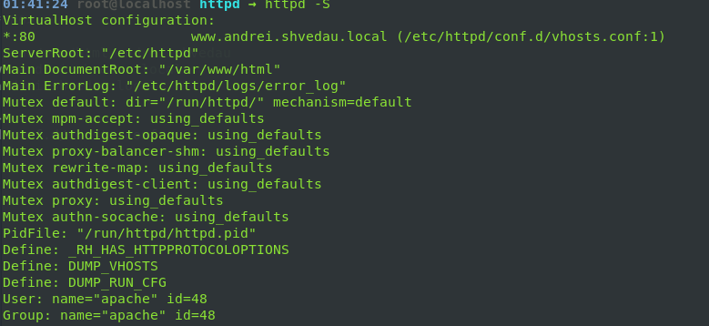
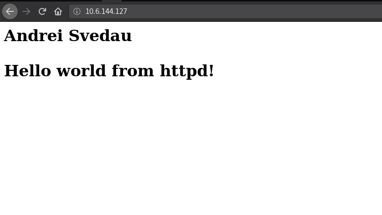
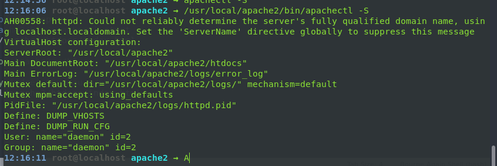
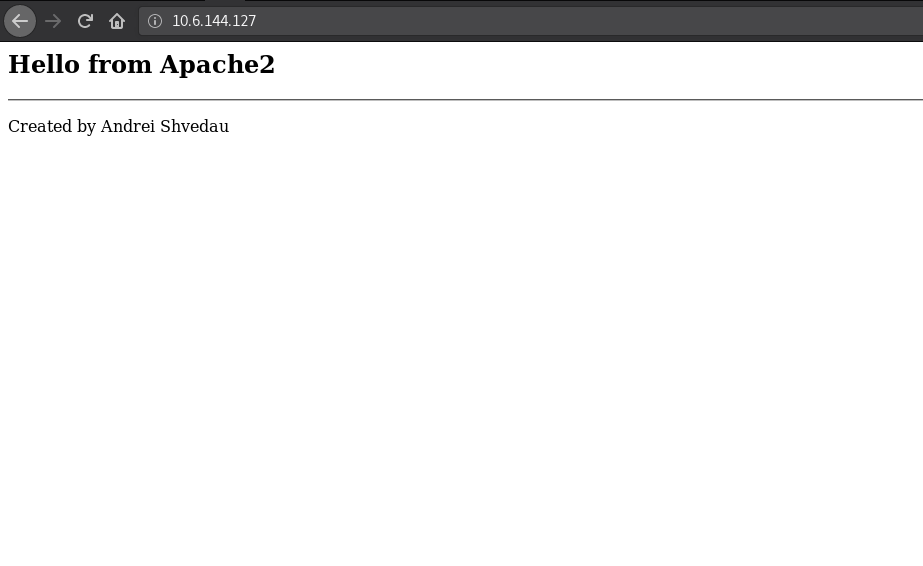
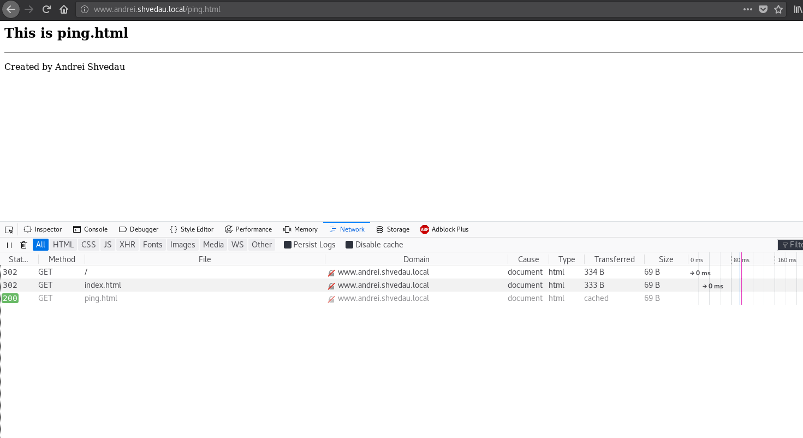
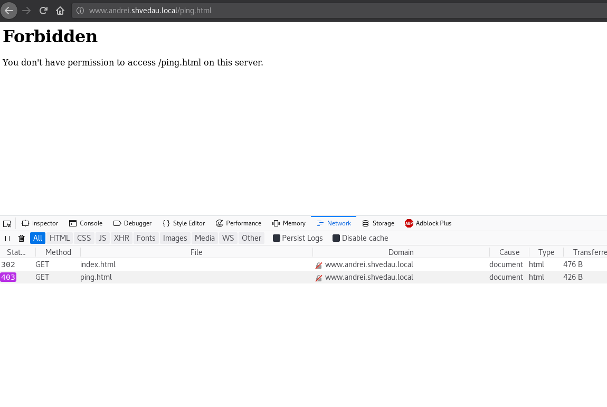
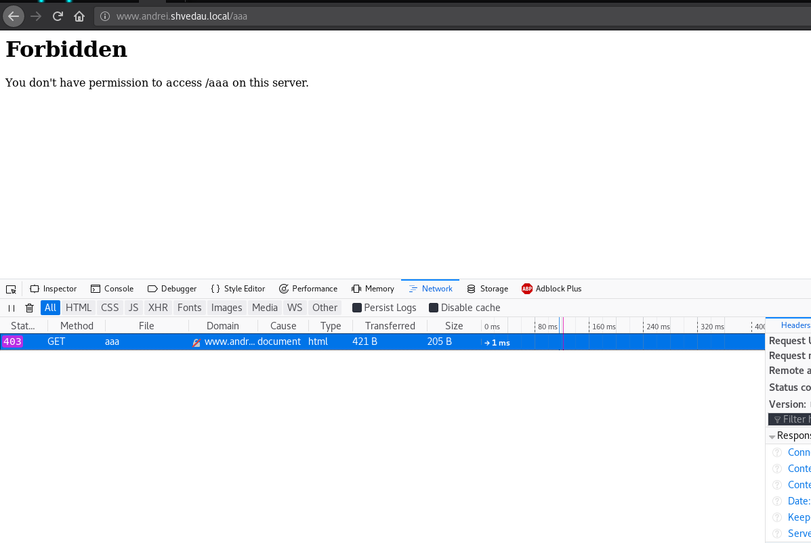
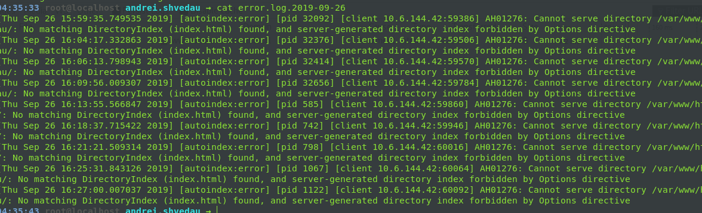
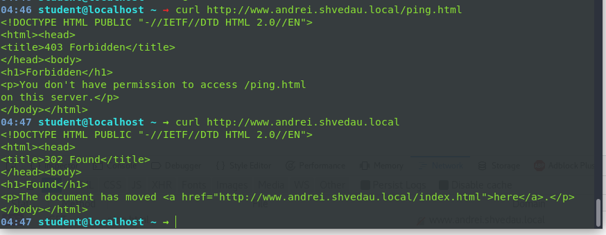
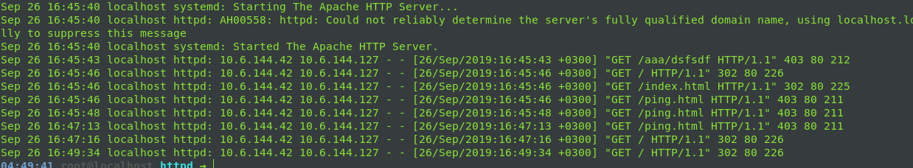

# Linux_DevOps_AS
Repo for scripts and stuff from EPAM devops lab.

# Day 1
# Overview: see hw_day1.sh file

## Task 1 
### Installing httpd and apache2
httpd:

apache2:

## Check
Graceful restart is a form of server restar./imgs/t, which when applied would advise server threads to exit when idle, and onl then reload the configuration.

## Task 2
### using vhosts and redirection

Redirect home:

Redirect /index.html:

Get forbiden on everything else

## Task 3
### using cronolog
using cronolog logging:

## Task4
### using syslog
sending curl request:

vieving logs:

