# Linux_DevOps_AS
Repo for scripts and stuff from EPAM devops lab.

# Day 1
## *For more details see hw_day1.sh file*

## Task 1 
### Installing httpd and apache2
httpd:  

apache2:  

## Check
Graceful restart is a form of server restart, which when applied would advise server threads to exit when idle, and onl then reload the configuration.

## Task 2
### using vhosts and redirection

Redirect home:  

Redirect /index.html:  

Get forbiden on everything else

## Task 3
### using cronolog
using cronolog logging:  

## Task4
### using syslog
sending curl request:  

vieving logs:  

# Day 2
## *For more details see hw_day2.sh file*

## Task 1 
### Using worker mpm 
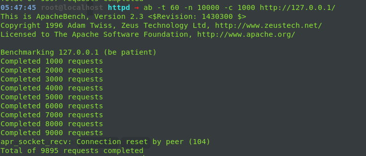
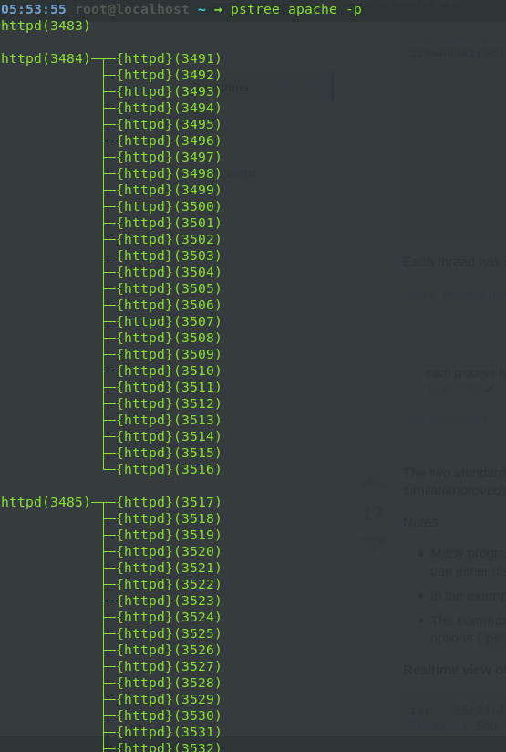

### Using prefork mpm 

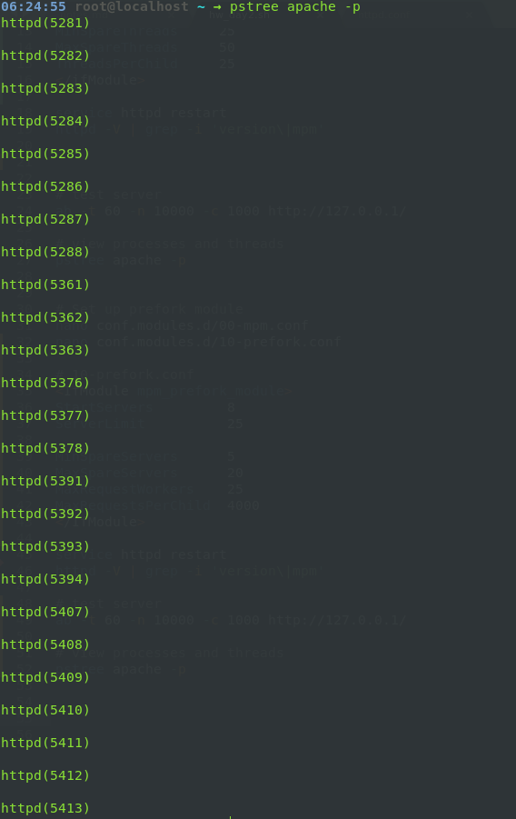

## Task 2
### forward proxy:
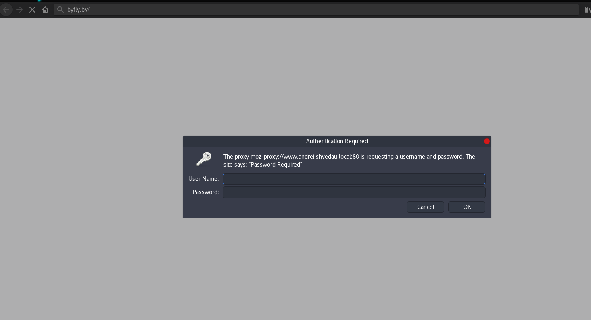

### rewerse proxy

# Day 3
## *For more details see hw_day3.sh file*

## Task 1 
### set up 3 VM with tomcat server
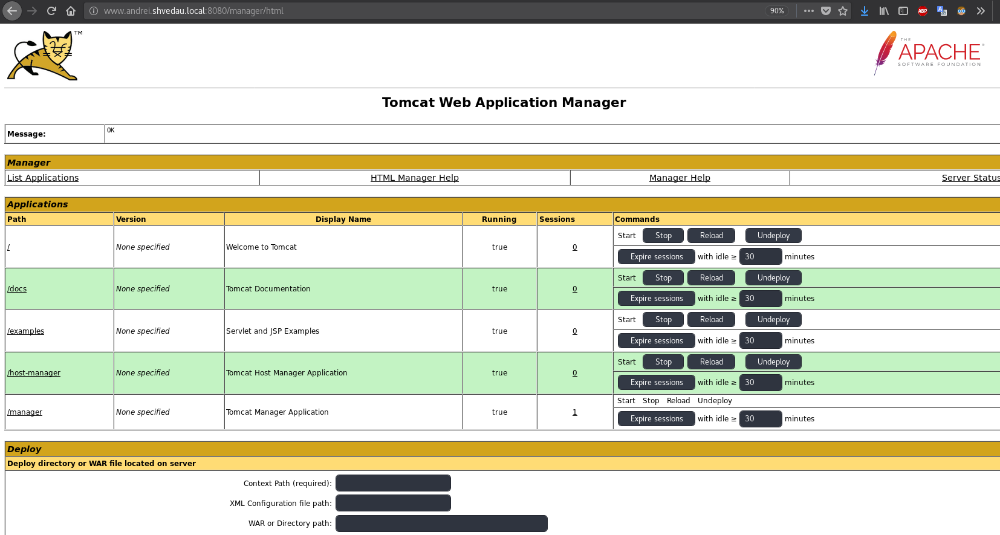
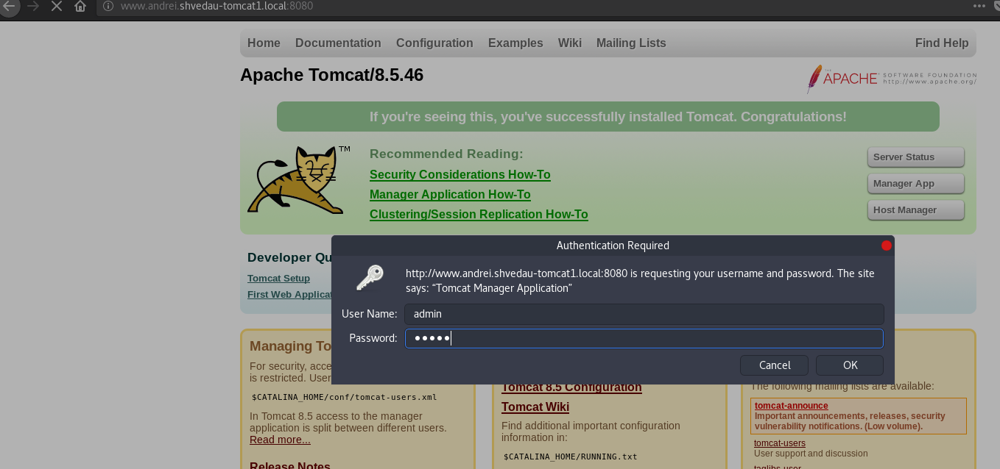

### file test.jsp:  
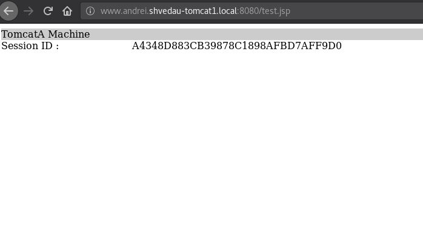
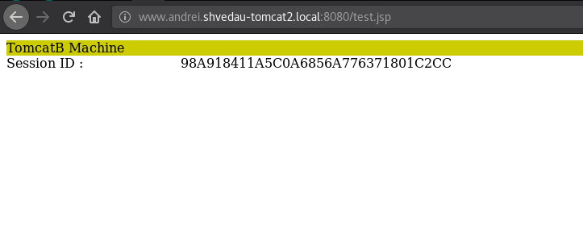
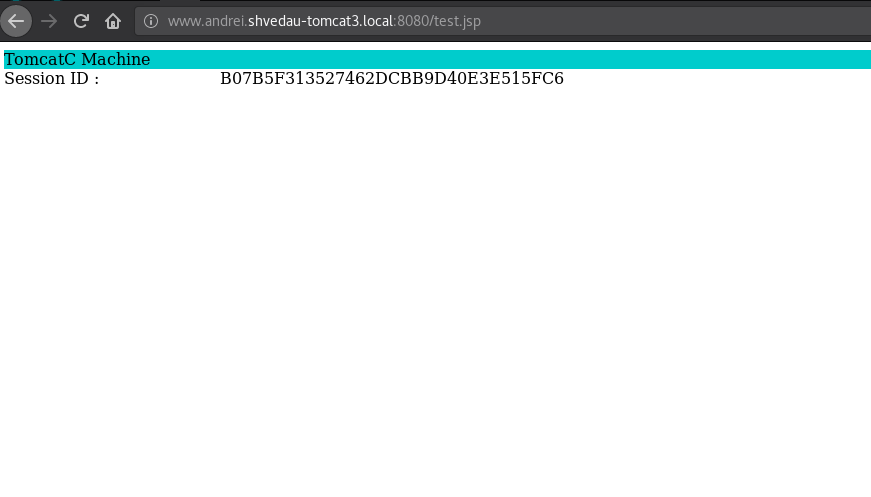

### deployment of clusterjsp.war
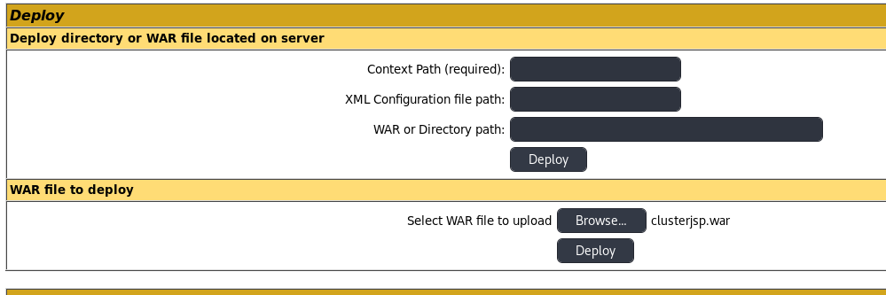
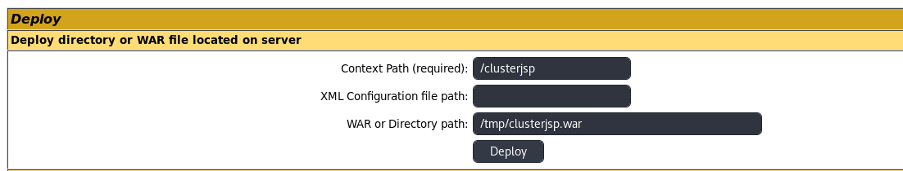
  
cluster on vm1:  
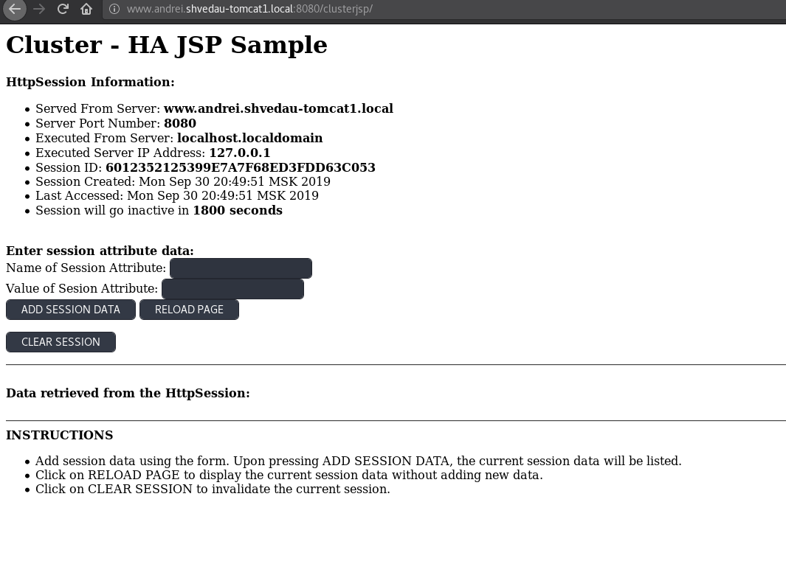

cluster on vm2:  
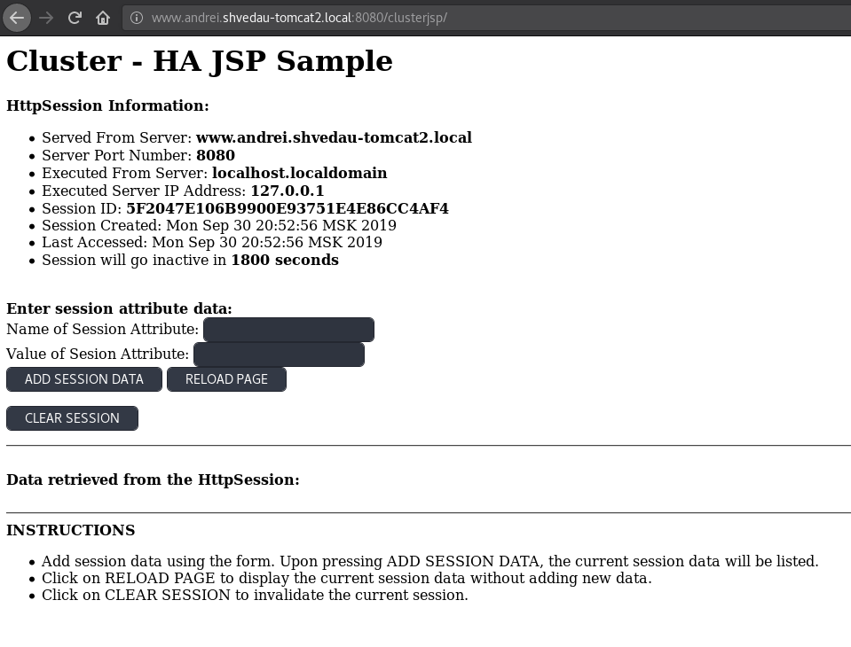

cluster on vm3:  
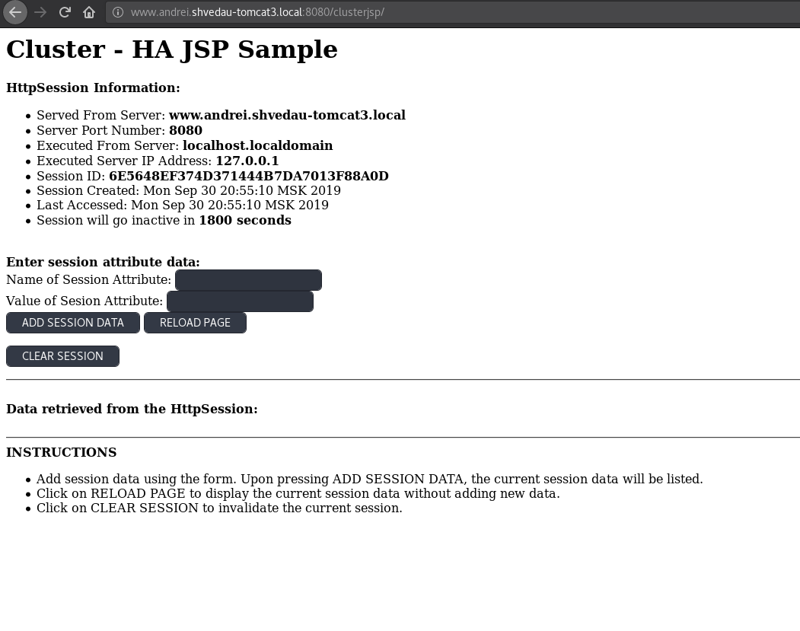

## Task 2
### cluster balancer:
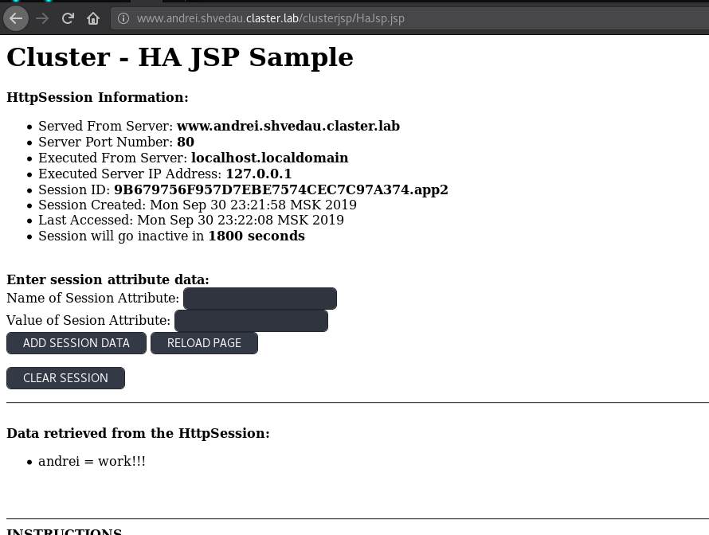

config files:  
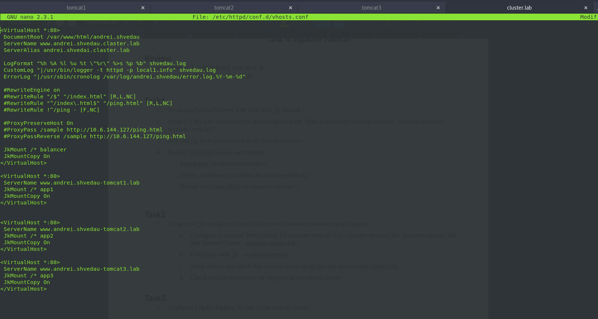
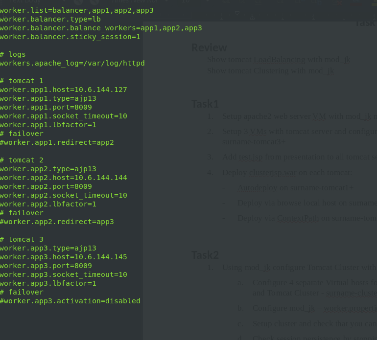

## Task 3
### Log4j2 on tomcat1
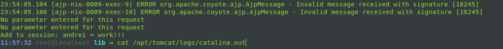
