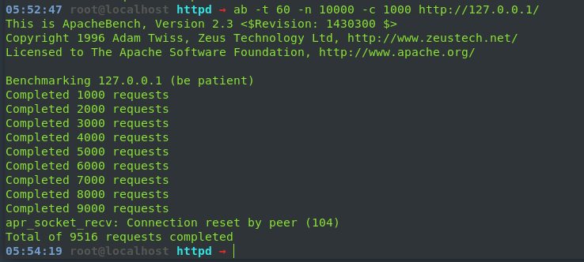

# Linux_DevOps_AS
Repo for scripts and stuff from EPAM devops lab.

# Day 2
## *For more details see hw_day2.sh file*

## Task 1 
### Using worker mpm 

### Using prefork mpm 

## Task 2
### forward proxy:

### rewerse proxy

